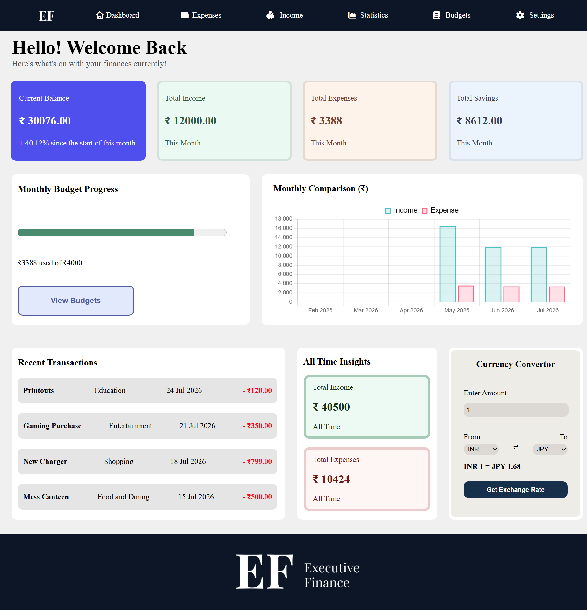
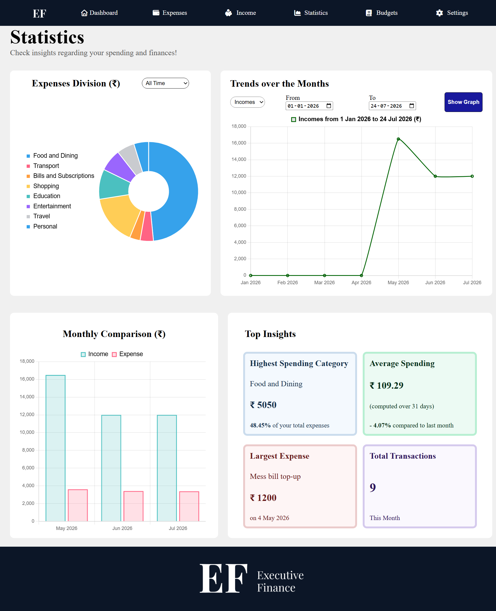

# Executive Finance

Executive Finance is a personal finance dashboard built using HTML, CSS, and JavaScript. It helps users track income, expenses, budgets, savings, and financial insights through an interactive interface.

## Features

- Dashboard with financial overview
- Income management
- Expense management
- Budget management
- Interactive charts and statistics
- Currency Converter
- CSV based import and export
- Local storage support
- Desktop First Design (Not fully responsive)

## Technologies Used

- HTML5
- CSS3
- JavaScript (Vanilla)
- Chart.js
- Local Storage
- APIs

## Deployed Website

[Executive Finance](https://lalettan1805.github.io/executive-finance/)

## Sample Screenshots

### Dashboard Page

### Statistics Page

